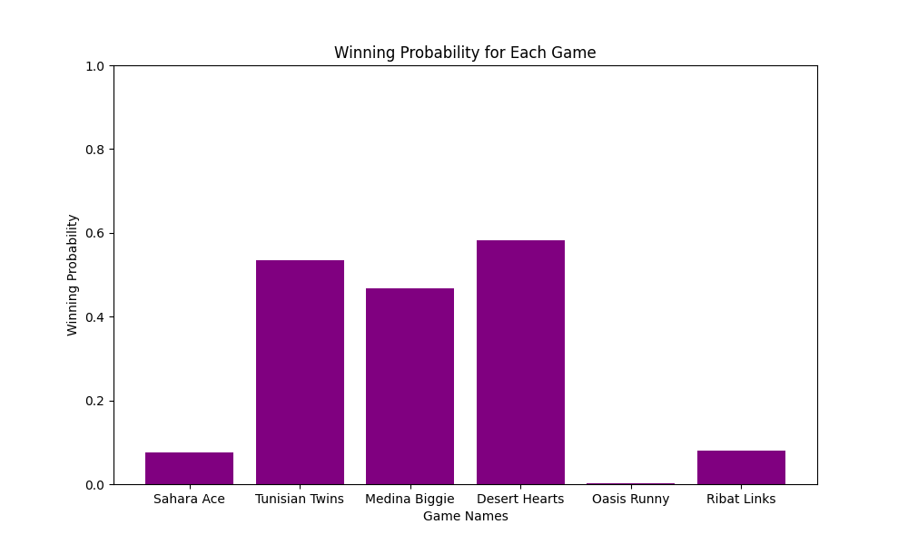

# Tunisian Card Games Simulation

## Overview

This project involves the implementation of a Monte Carlo simulation in Python to evaluate and compare the probabilities of winning and expected winnings for six different Tunisian card games.

## Statistic outputs

| Game              | Probability | Wins   | Expected Winnings (TND)  |
| ----------------- | ----------- | ------ | ------------------------ |
| Sahara Ace        | 7.63%       | 7629   | 76290                    |
| Tunisian Twins    | 53.15%      | 53155  | 2657750                  |
| Medina Biggie     | 46.55%      | 46550  | 93100                    |
| Desert Hearts     | 58.20%      | 58203  | 74899                    |
| Oasis Runny       | 0.34%       | 336    | 1680                     |
| Ribat Links       | 8.08%       | 8075   | 80750                    |

*Note: The values are based on 100,000 simulations per game.*

## Best Game To Deploy
Based on the statistics below Desert Hearts is the most suitable game to deploy with a high probability of 58.20%.



## User Manual

### Running the Simulation
To run the simulation, execute the `simulation.py` script using Python. Ensure that you have the necessary dependencies installed.
*You can modify the number_of_simulations variable to adjust*

### Simulation Output
Probability: The chance of winning the game.
Wins: The number of rounds won during simulations.
Expected Winnings: The total money earned.

### Simulation Files
- `simulation.py`: Python script containing the Monte Carlo simulation, game classes, and useful functions.
- `README.md`: Documentation file describing the project and how to run the simulation.
- `results_chart.png`: Sample chart generated based on simulation results.


```bash
python simulation.py
